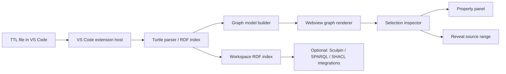

## Goal

Build a **VS Code extension for `.ttl` / Turtle graph visualization** that works like a lightweight, IDE-native graph explorer:

* Open any Turtle file and render it as an RDF graph.
* Select nodes or edges in the visualization.
* Inspect RDF properties, predicates, literals, datatypes, language tags, source file, and eventually source line.
* Navigate from graph elements back to the Turtle source.
* Later integrate with Sculpin knowledge-base workflows, ontology visualization, and possibly SPARQL endpoints.

The best technical fit is a **TypeScript VS Code extension with a webview-based graph UI**. VS Code webviews are designed for custom visual interfaces and visualizations beyond the native API, and custom editors can provide file-specific UI with save/undo/editor-event integration. ([Visual Studio Code][1])

---

# Recommended architecture



## Core components

| Component               | Responsibility                                                                    |
| ----------------------- | --------------------------------------------------------------------------------- |
| `extension.ts`          | Registers commands, custom editor, webview, file watchers, and workspace indexing |
| `rdf/parser.ts`         | Parses Turtle into RDF quads using `N3.Parser`                                    |
| `rdf/model.ts`          | Converts RDF quads into internal node/edge/property model                         |
| `rdf/index.ts`          | Maintains per-file and workspace-level RDF graph index                            |
| `webview/`              | React/Vite frontend embedded in VS Code                                           |
| `webview/graph.tsx`     | Interactive graph rendering                                                       |
| `webview/inspector.tsx` | Node/edge details panel                                                           |
| `protocol/messages.ts`  | Strongly typed messages between extension host and webview                        |
| `test/`                 | Parser, graph-model, message, and extension integration tests                     |

`N3.js` is a good first parser choice because `N3.Parser` can transform Turtle, TriG, N-Triples, and N-Quads into RDF quads, and can parse synchronously or through callbacks/streams. ([GitHub][2])

For rendering, use **Cytoscape.js** for the first version. It is an open-source JavaScript graph library for graph analysis and visualization. ([js.cytoscape.org][3]) For automatic layout, add `elkjs` later; ELK is well suited for automatic layout of node-link diagrams and layered directed graphs. ([npm][4])

---

# Product scope

## MVP: local Turtle graph viewer

The first usable version should support:

1. **Open graph preview**

   * Command: `Turtle Graph: Open Preview`
   * Available for `.ttl`, `.rdf`, `.nt`, `.nq`, `.trig`
   * Opens a VS Code webview beside the editor.

2. **Parse active Turtle document**

   * Parse the current file into RDF quads.
   * Show parse errors in a VS Code diagnostic collection.
   * Re-render graph on save or document change, debounced.

3. **Render graph**

   * RDF resources and blank nodes become graph nodes.
   * Object-property triples become edges.
   * Literal triples become node properties.
   * Predicate labels are compacted using known prefixes.

4. **Inspect selection**

   * Selecting a node shows:

     * IRI / blank node ID
     * compact label
     * RDF types
     * incoming predicates
     * outgoing predicates
     * literal properties
   * Selecting an edge shows:

     * subject
     * predicate
     * object
     * graph name, if present
     * source file
     * raw triple/quads

5. **Source navigation**

   * Button: `Reveal in Turtle`
   * MVP can use best-effort text search for the selected triple.
   * Later improve with exact source spans.

6. **Basic UX**

   * Search node by label/IRI.
   * Filter by predicate.
   * Hide literals / show literals.
   * Reset layout.
   * Export current graph as SVG/PNG/JSON.

---

# Important design decision: don’t embed the whole graph-explorer first

The existing SemanticMatter graph explorer and similar tools are great references, but the VS Code plugin should start as a **focused local-file IDE tool**, not a full SPARQL endpoint explorer.

Graph Explorer itself is a JavaScript application/library for visualizing and navigating RDF graph data, configurable for SPARQL endpoints and web-loaded RDF resources. ([GitHub][5]) That makes it useful inspiration, but for the VS Code use case the first priority should be:

* fast local Turtle parsing,
* source-code navigation,
* diagnostics,
* IDE-native commands,
* file watching,
* small bundle size,
* offline use.

SPARQL endpoint exploration can be phase 3.

---

# Graph model rules

## RDF-to-visual graph mapping

Use this conversion model:

```ts
type RdfNodeKind = "iri" | "blankNode" | "literal";

type GraphNode = {
  id: string;
  kind: "resource" | "blankNode";
  iri?: string;
  label: string;
  types: string[];
  properties: LiteralProperty[];
  incoming: string[];
  outgoing: string[];
  sourceRefs: SourceRef[];
};

type GraphEdge = {
  id: string;
  subject: string;
  predicate: string;
  object: string;
  label: string;
  graph?: string;
  sourceRefs: SourceRef[];
};
```

### Triple handling

| RDF triple shape                                                          | Visualization                         |
| ------------------------------------------------------------------------- | ------------------------------------- |
| `<s> <p> <oIRI>`                                                          | edge from subject node to object node |
| `<s> <p> _:blank`                                                         | edge from subject node to blank node  |
| `<s> <p> "literal"`                                                       | literal property on subject node      |
| `<s> rdf:type <Class>`                                                    | node type/class badge                 |
| `rdfs:label`, `skos:prefLabel`, `dcterms:title`                           | preferred visual label                |
| `owl:Class`, `rdf:Property`, `owl:ObjectProperty`, `owl:DatatypeProperty` | optional ontology-specific styling    |

---

# UX concept

## Main view layout

```text
┌────────────────────────────────────────────────────────────┐
│ Toolbar: Search | Predicate filter | Layout | Export       │
├───────────────────────────────────────┬────────────────────┤
│                                       │ Inspector          │
│ Interactive RDF graph                 │                    │
│                                       │ Selected node/edge │
│ Nodes, edges, labels, badges          │ Properties         │
│                                       │ Source refs        │
│                                       │ Actions            │
└───────────────────────────────────────┴────────────────────┘
```

## Sidebar view

Use a native VS Code Tree View for lightweight navigation:

* Current file
* Prefixes
* Classes
* Properties
* Instances
* Blank nodes
* Parse diagnostics

VS Code’s Tree View API supports contributed views through `package.json`, a `TreeDataProvider`, and command/view actions. ([Visual Studio Code][6])

---

# Development phases

## Phase 0 — Repository setup

Create the extension scaffold.

Recommended stack:

```text
TypeScript
VS Code Extension API
Vite
React
Cytoscape.js
N3.js
Vitest
ESLint
Prettier
```

Initial structure:

```text
ttl-graph-viewer/
  package.json
  tsconfig.json
  vite.config.ts
  vitest.config.ts
  src/
    extension.ts
    commands/
      openPreview.ts
    rdf/
      parser.ts
      compactIri.ts
      model.ts
      index.ts
      sourceLocator.ts
    protocol/
      messages.ts
    diagnostics/
      turtleDiagnostics.ts
    webview/
      main.tsx
      App.tsx
      GraphCanvas.tsx
      InspectorPanel.tsx
      Toolbar.tsx
      styles.css
  test/
    fixtures/
      simple.ttl
      ontology.ttl
      literals.ttl
      broken.ttl
    parser.test.ts
    model.test.ts
    compactIri.test.ts
    sourceLocator.test.ts
  README.md
  CHANGELOG.md
```

Deliverable: extension launches in VS Code Extension Development Host.

---

## Phase 1 — Turtle parser and graph model

Implement:

* `parseTurtleDocument(text, baseIri)`
* prefix extraction
* quad normalization
* compact IRI helper
* RDF graph model builder
* stable node/edge IDs
* literal property grouping

Tests:

* parses simple Turtle
* handles prefixes
* handles blank nodes
* handles typed literals
* handles language-tagged strings
* handles `rdf:type`
* generates deterministic graph model

Deliverable: command-line or unit-test verified RDF graph model.

---

## Phase 2 — Webview graph preview

Implement:

* command `ttlGraph.openPreview`
* create webview panel
* send graph model to webview
* render nodes and edges with Cytoscape.js
* support zoom, pan, fit, reset layout
* support node and edge click
* send selected element back to extension host or update inspector locally

Deliverable: user can open a `.ttl` file and inspect graph visually.

---

## Phase 3 — Inspector panel

Implement:

* node inspector
* edge inspector
* prefix-aware compact display
* copy IRI / copy compact name
* show raw RDF terms
* show literal datatype/language
* show incoming/outgoing relationships
* click related node to focus it

Deliverable: selected graph elements are inspectable without leaving VS Code.

---

## Phase 4 — Source navigation and diagnostics

Implement:

* parse errors as VS Code diagnostics
* best-effort source locator
* `Reveal in Turtle` action
* editor selection jump
* document-change debounce
* graph refresh on save

Important caveat: `N3.Parser` gives parsed quads, but exact source ranges are not the primary output shown in the public parser examples. The first implementation should use best-effort source lookup, then improve later with tokenizer/source-map work if exact spans are needed.

Deliverable: selected node/edge can navigate back to approximate source location.

---

## Phase 5 — Workspace graph index

Implement:

* scan workspace for RDF files
* sidebar tree with classes/properties/instances
* multi-file graph mode
* file-level include/exclude
* prefix registry
* duplicate IRI merge
* graph statistics

Deliverable: user can explore an ontology or RDF workspace, not just one file.

---

## Phase 6 — Sculpin integration

Add Sculpin-aware features:

* command: `Sculpin Graph: Open Local Turtle Visualization`
* command: `Sculpin Graph: Export Selection`
* open generated `.ttl` artifacts from Sculpin runs
* optionally read `.sculpin/graph-viewer.json`
* support ontology conventions used in Sculpin KBs
* recognize common vocabularies:

  * `rdf`
  * `rdfs`
  * `owl`
  * `skos`
  * `dcterms`
  * `prov`
  * `shacl`

Potential config:

```json
{
  "ttlGraphViewer.defaultLayout": "cose",
  "ttlGraphViewer.maxInitialNodes": 500,
  "ttlGraphViewer.preferredLabels": [
    "rdfs:label",
    "skos:prefLabel",
    "dcterms:title"
  ],
  "ttlGraphViewer.literalPredicatesAsBadges": [
    "rdf:type",
    "sh:targetClass"
  ],
  "ttlGraphViewer.hidePredicates": []
}
```

Deliverable: useful for inspecting Sculpin ontology and generated RDF artifacts directly inside the IDE.

---

## Phase 7 — Advanced features

Add after the MVP is stable:

* SHACL validation overlay
* ontology class/property styling
* inferred graph overlay
* compare two Turtle files
* visual diff between branches
* SPARQL endpoint mode
* query builder
* graph bookmarks
* saved diagrams
* Mermaid export
* SVG/PNG export
* “explain this node” command for Claude/Copilot workflows
* local MCP endpoint for graph inspection

---

# Testing strategy

## Unit tests

Cover:

* Turtle parsing
* prefix compaction
* label selection
* RDF type extraction
* literal grouping
* blank node handling
* deterministic graph IDs
* edge generation
* filtering

## Extension tests

Cover:

* command registration
* opening preview
* diagnostic creation on invalid Turtle
* refresh on document change
* reveal source command

## Webview tests

Cover:

* receives graph model
* renders nodes and edges
* selection updates inspector
* filters update graph
* search focuses node

## Fixture files

Create fixtures like:

```text
simple.ttl
ontology.ttl
blank-nodes.ttl
literals.ttl
shacl.ttl
prov.ttl
invalid.ttl
large.ttl
```

---

# Claude Code implementation plan

Give Claude Code the work in small, testable prompts. Do not ask it to build everything at once.

## Prompt 1 — Scaffold the extension

```text
You are working in a new repository. Create a production-quality VS Code extension named `ttl-graph-viewer`.

Goal:
Build an IDE-native Turtle/RDF graph visualization extension.

Initial scope:
- TypeScript VS Code extension.
- Vite + React webview frontend.
- Vitest for unit tests.
- ESLint and Prettier.
- Command: `Turtle Graph: Open Preview`.
- The command may initially open a placeholder webview.

Requirements:
- Create `package.json`, `tsconfig.json`, `vite.config.ts`, `vitest.config.ts`, README, and source folder structure.
- Use clean modular structure:
  - `src/extension.ts`
  - `src/commands/openPreview.ts`
  - `src/protocol/messages.ts`
  - `src/webview/App.tsx`
- Add scripts for build, watch, test, lint, package.
- Do not implement RDF parsing yet.
- Make the extension runnable in VS Code Extension Development Host.
- Add a short README with setup and development commands.

After implementing, run tests/build and report exactly what passes or fails.
```

---

## Prompt 2 — Add Turtle parsing and graph model

```text
Implement the RDF/Turtle parsing layer.

Requirements:
- Add `n3` as dependency.
- Create:
  - `src/rdf/parser.ts`
  - `src/rdf/compactIri.ts`
  - `src/rdf/model.ts`
- Implement `parseTurtleDocument(text: string, baseIRI?: string)`.
- Implement conversion from RDF quads to a graph model:
  - IRI and blank node resources become graph nodes.
  - Object-resource triples become graph edges.
  - Literal triples become node properties.
  - `rdf:type` becomes a node type.
  - Preferred labels should use `rdfs:label`, `skos:prefLabel`, then local IRI fragment.
- Define strongly typed interfaces for parsed document, graph node, graph edge, literal property, prefix map, and parse errors.
- Add fixtures:
  - `test/fixtures/simple.ttl`
  - `test/fixtures/literals.ttl`
  - `test/fixtures/blank-nodes.ttl`
- Add Vitest tests covering parsing, prefix compaction, label selection, literal grouping, blank nodes, and deterministic edge IDs.

Run tests and fix all failures.
```

---

## Prompt 3 — Render graph in webview

```text
Implement the first real graph preview.

Requirements:
- Add Cytoscape.js to the webview frontend.
- When `Turtle Graph: Open Preview` is executed on an active `.ttl` file:
  - read the active editor text,
  - parse it,
  - build graph model,
  - open a webview panel,
  - send graph model to the webview.
- The webview must render nodes and edges.
- Include toolbar buttons:
  - Fit graph
  - Reset layout
  - Refresh
- Use VS Code theme-friendly styling.
- Keep the graph usable for small and medium TTL files.
- Add graceful empty/error states.
- Do not add Sculpin integration yet.

Add tests for the graph model and message payload generation. Manually verify extension launch if automated VS Code UI tests are not practical.
```

---

## Prompt 4 — Add node and edge inspector

```text
Add selection inspection.

Requirements:
- In the webview, clicking a node opens an inspector panel showing:
  - node label
  - full IRI or blank node ID
  - RDF types
  - literal properties
  - incoming edge count
  - outgoing edge count
- Clicking an edge shows:
  - subject
  - predicate
  - object
  - compact label
  - full IRI values where applicable
- Add copy buttons for IRI and compact name.
- Add search by node label/IRI.
- Add predicate filter.
- Keep all webview messages strongly typed in `src/protocol/messages.ts`.
- Add component-level tests where practical and unit tests for selection model helpers.
```

---

## Prompt 5 — Add diagnostics and refresh behavior

```text
Add editor integration.

Requirements:
- Create a VS Code diagnostic collection for Turtle parse errors.
- On parse failure, show diagnostics in the active document and display a friendly webview error.
- Refresh graph when:
  - document is saved,
  - user clicks Refresh,
  - active document changes and preview is open.
- Debounce document-change refresh.
- Add configuration:
  - `ttlGraphViewer.refreshOnChange`
  - `ttlGraphViewer.maxInitialNodes`
  - `ttlGraphViewer.preferredLabels`
- If graph exceeds `maxInitialNodes`, show a filtered overview instead of freezing the UI.
- Add tests for configuration loading and parse-error normalization.
```

---

## Prompt 6 — Add source navigation

```text
Implement best-effort source navigation.

Requirements:
- Add `src/rdf/sourceLocator.ts`.
- For each graph edge and literal property, attempt to locate the corresponding Turtle statement in the source text.
- Add `Reveal in Turtle` button in the inspector.
- When clicked, send a message to the extension host and reveal the best available source range in the text editor.
- Be honest in code comments and README that source locations are best-effort in this phase.
- Add tests for source lookup on simple one-line and multi-line Turtle fixtures.
```

---

## Prompt 7 — Add workspace index and tree view

```text
Add a workspace-level RDF navigation view.

Requirements:
- Add a VS Code Tree View named `Turtle Graph`.
- Show:
  - current file prefixes
  - classes
  - properties
  - instances
  - parse errors
- Implement a workspace scanner for `.ttl`, `.trig`, `.nt`, `.nq`.
- Merge resources with the same IRI across files.
- Add commands:
  - `Turtle Graph: Reindex Workspace`
  - `Turtle Graph: Open Workspace Graph`
  - `Turtle Graph: Open Resource`
- Keep indexing bounded and cancellable for large workspaces.
- Add tests for workspace index merging.
```

---

## Prompt 8 — Add Sculpin-oriented polish

```text
Add Sculpin-friendly features without hard-coding private assumptions.

Requirements:
- Add optional config file support for `.sculpin/graph-viewer.json`.
- Add built-in vocabulary presets for RDF, RDFS, OWL, SKOS, DCTERMS, PROV, and SHACL.
- Add ontology-aware styling:
  - classes
  - object properties
  - datatype properties
  - SHACL node shapes
  - PROV activities/entities/agents
- Add command:
  - `Sculpin Graph: Open Turtle Visualization`
- Add export:
  - current visual graph as JSON
  - selected node neighborhood as Turtle/N-Triples if feasible
- Update README with Sculpin usage examples.
- Add fixtures for OWL, SHACL, and PROV.
```

---

# Acceptance criteria for MVP

The MVP is ready when:

* Opening a `.ttl` file and running `Turtle Graph: Open Preview` shows a graph.
* Nodes and edges are selectable.
* Node and edge properties are inspectable.
* Literal properties are visible.
* Prefixes are compacted.
* Parse errors are shown clearly.
* The graph refreshes when the file changes.
* The extension does not freeze on moderately sized files.
* Unit tests cover parsing and graph-model conversion.
* README explains installation, usage, limitations, and known issues.

---

# Suggested first milestone

The first Claude Code milestone should be:

> **A working local `.ttl` graph preview with clickable nodes/edges and an inspector panel.**

Avoid SPARQL, SHACL validation, Sculpin API integration, and exact source maps until the basic local IDE loop feels excellent.

[1]: https://code.visualstudio.com/api/extension-guides/webview "Webview API | Visual Studio Code Extension
API"
[2]: https://github.com/rdfjs/N3.js/ "GitHub - rdfjs/N3.js: Lightning fast, spec-compatible, streaming RDF for JavaScript · GitHub"
[3]: https://js.cytoscape.org/?utm_source=chatgpt.com "Cytoscape.js"
[4]: https://www.npmjs.com/package/elkjs?utm_source=chatgpt.com "elkjs"
[5]: https://github.com/zazuko/graph-explorer "GitHub - zazuko/graph-explorer: Graph Explorer can be used to explore RDF graphs in SPARQL endpoints or on the web. · GitHub"
[6]: https://code.visualstudio.com/api/extension-guides/tree-view "Tree View API | Visual Studio Code Extension
API"
